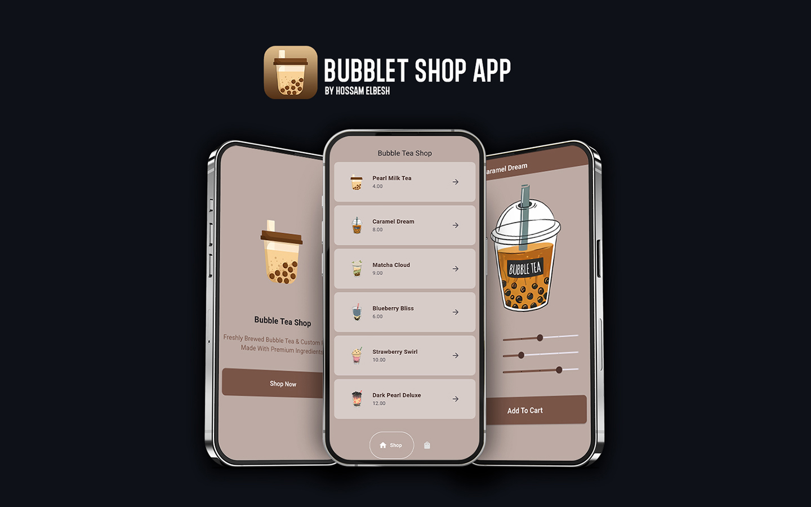

# Bubble Tea Shop App

A Flutter application for a fictional bubble tea shop that allows users to browse drinks, customize their orders, and add items to a shopping cart. The app is designed to provide a smooth and engaging user experience, with features such as customizable drink options, a cart page, and a shop page.

## Features

- **Intro Page**: Displays the shop's introduction with a "Shop Now" button leading to the main shop page.
- **Shop Page**: A list of available bubble tea drinks with the option to navigate to a detailed order page for customization.
- **Customization**: Customize your drink by adjusting sweetness, ice, and pearls levels before adding it to the cart.
- **Cart Page**: View all items added to the cart, and remove items if necessary.
- **Order Summary**: Provides a summary of selected drinks and customizations before proceeding to checkout.

### Prerequisites

- Flutter SDK: [Install Flutter](https://flutter.dev/docs/get-started/install)
- A code editor like Visual Studio Code or Android Studio

## Getting Started

This project is a starting point for a Flutter application.

A few resources to get you started if this is your first Flutter project:

- [Lab: Write your first Flutter app](https://docs.flutter.dev/get-started/codelab)
- [Cookbook: Useful Flutter samples](https://docs.flutter.dev/cookbook)

For help getting started with Flutter development, view the
[online documentation](https://docs.flutter.dev/), which offers tutorials,
samples, guidance on mobile development, and a full API reference.
